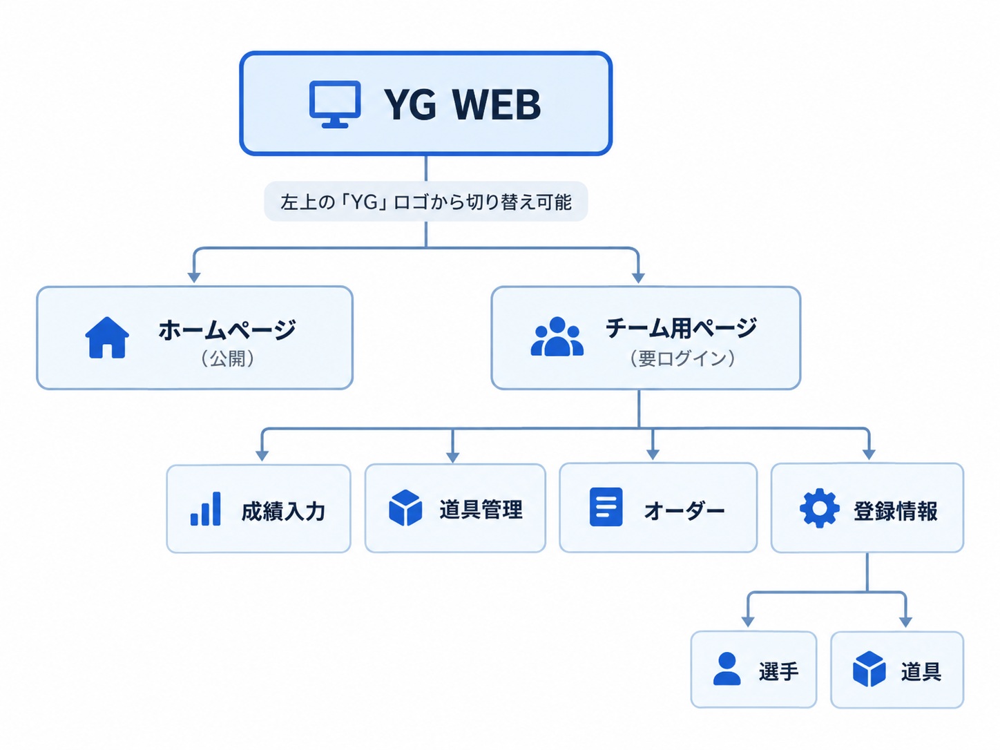

# baseball-member-app-v3

開発時のファイル構成・設定値・保存処理は [開発・保守ガイド](docs/development-guide.md) を参照してください。

既存DBを使う場合は [DB正規化の移行手順](docs/database-normalization.md)、[メンバーログイン・オーダー編集権限の適用手順](docs/member-login.md)、[道具のLINE通知設定の適用手順](docs/equipment-line-notifications.md)、[スケジュール・出欠管理の適用手順](docs/schedule-management.md)、[YGミニゲームの適用手順](docs/mini-games.md) を確認してください。現在のアプリの公開前に `0010_mini_games.sql` までの適用が必要です。未適用の移行を順に一度だけ実行し、`0009` まで適用済みなら `0010` だけを追加適用します。今回のミニゲーム追加に伴う週次Workerの変更はありません。

スケジュールでは開始時刻・場所の変更前後を確認でき、変更した本人以外の回答済みメンバーに再確認を促します。オーダーは登録済みの試合を選び、試合ごとのスタメンを保存します。チーム名・監督名は管理者のチーム設定で変更します。

YGチームメニューの「YGミニゲーム」から「川高の振れ！チンチロ！」を遊べます。ログイン中のメンバー名で自己ベストを保存し、ゲーム別の上位ランキングを表示します。

## 🗺️ 今後の画面構成


## ローカル開発環境のセットアップ

### 1. パッケージをインストール

```bash
npm install
```

---

### 2. 環境変数を用意

`.env.example` をコピーして `.dev.vars` を作成します。

PowerShell:

```powershell
Copy-Item .env.example .dev.vars
```

`.env.example` には以下の項目があります。

```env
TEAM_BOOTSTRAP_PASSWORD=
AUTH_PEPPER=
```

ローカル開発用の値を設定してください。

例:

```env
TEAM_BOOTSTRAP_PASSWORD=test1234
AUTH_PEPPER=abcdefghijklmnopqrstuvwxyz123456
```

`.dev.vars` はGit管理しません。

---

### 3. Cloudflare用設定を生成

```bash
npm run build
```

`dist/server/wrangler.json` が生成されます。

---

### 4. ローカルDBを初期化

ローカルでは Cloudflare D1 のSQLite版を使用します。

```powershell
npx wrangler d1 execute yg_member_db --local --persist-to="./.wrangler/state" --file="./drizzle/0000_military_bloodstrike.sql" --config="./dist/server/wrangler.json"
npx wrangler d1 execute yg_member_db --local --persist-to="./.wrangler/state" --file="./drizzle/0001_add_equipment_state.sql" --config="./dist/server/wrangler.json"
npx wrangler d1 execute yg_member_db --local --persist-to="./.wrangler/state" --file="./drizzle/0002_add_stats_state.sql" --config="./dist/server/wrangler.json"
npx wrangler d1 execute yg_member_db --local --persist-to="./.wrangler/state" --file="./drizzle/0003_normalize_data.sql" --config="./dist/server/wrangler.json"
npx wrangler d1 execute yg_member_db --local --persist-to="./.wrangler/state" --file="./drizzle/0004_member_devices.sql" --config="./dist/server/wrangler.json"
npx wrangler d1 execute yg_member_db --local --persist-to="./.wrangler/state" --file="./drizzle/0005_lineup_permissions.sql" --config="./dist/server/wrangler.json"
npx wrangler d1 execute yg_member_db --local --persist-to="./.wrangler/state" --file="./drizzle/0006_equipment_line_notifications.sql" --config="./dist/server/wrangler.json"
npx wrangler d1 execute yg_member_db --local --persist-to="./.wrangler/state" --file="./drizzle/0007_schedules.sql" --config="./dist/server/wrangler.json"
npx wrangler d1 execute yg_member_db --local --persist-to="./.wrangler/state" --file="./drizzle/0008_schedule_updates.sql" --config="./dist/server/wrangler.json"
npx wrangler d1 execute yg_member_db --local --persist-to="./.wrangler/state" --file="./drizzle/0009_schedule_lineups.sql" --config="./dist/server/wrangler.json"
npx wrangler d1 execute yg_member_db --local --persist-to="./.wrangler/state" --file="./drizzle/0010_mini_games.sql" --config="./dist/server/wrangler.json"
```

ローカルDBは以下に保存されます。

```text
.wrangler/state/
```

---

### 5. テストデータを投入

開発用として、選手16名・道具9個の初期データを投入します。

`drizzle/seed.local.sql` を使用します。

```powershell
npx wrangler d1 execute yg_member_db --local --persist-to="./.wrangler/state" --file="./drizzle/seed.local.sql" --config="./dist/server/wrangler.json"
```

`seed.local.sql` はチーム・予定・道具・成績・ミニゲームを初期化するローカル開発専用SQLです。既存データを移行する場合は実行しません。

---

### 6. アプリを起動

```bash
npm run dev
```

ブラウザで以下へアクセスします。

```text
http://localhost:5173
```

ログインには `.dev.vars` の

```env
TEAM_BOOTSTRAP_PASSWORD
```

に設定したパスワードを使用します。

---

## 2回目以降

通常は以下だけでOKです。

```bash
npm run dev
```

DBを初期化し直したい場合は `.wrangler/state` を削除して、手順4・5を再実行してください。

PowerShell:

```powershell
Remove-Item -Recurse -Force .wrangler\state
```

---

## ローカルDBを確認する

テーブル一覧:

```powershell
npx wrangler d1 execute yg_member_db --local --persist-to="./.wrangler/state" --config="./dist/server/wrangler.json" --command="SELECT name FROM sqlite_master WHERE type='table';"
```

アプリデータ:

```powershell
npx wrangler d1 execute yg_member_db --local --persist-to="./.wrangler/state" --config="./dist/server/wrangler.json" --command="SELECT * FROM players WHERE sort_order IS NOT NULL ORDER BY sort_order;"
```

SQLiteファイルをA5:SQL Mk-2などで直接確認することもできます。

DB本体は以下の配下にあります。

```text
.wrangler/state/v3/d1/miniflare-D1DatabaseObject/
```

---

## 注意

ローカルDBと本番DBは別です。

```text
--local   ローカルDB
--remote  Cloudflare上の本番DB
```

通常の開発では必ず `--local` を使用してください。
